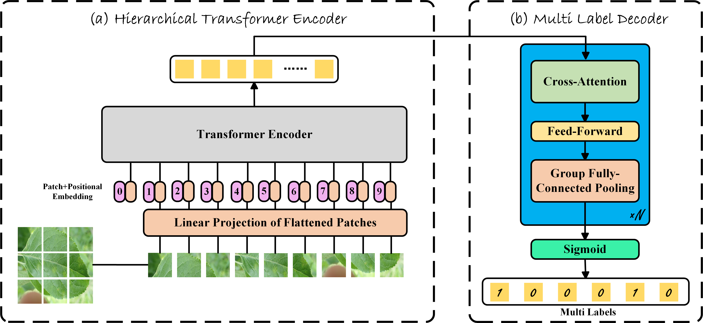
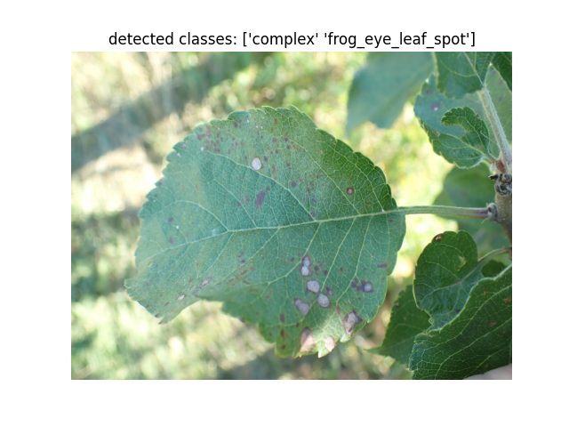

# VisiontransformerEncoder-MultiLabelDecoder: ViT for multilabel image classification


**Abstract**

The ViT (Vision Transformer) model, known for its excellence, has been widely used in computer vision tasks. Multilabel image classification is one of the important task in computer vision. However, due to the convenience of decoding, most existing models are based on CNN. In this work, transformer encoder is combined with the ML-Decoder proposed by Tal Ridnik et al. to create a Transformer encoder-decoder framework specifically designed for multilabel classification.


<p align="center">
 <table class="tg">
  <tr>
    <td class="tg-c3ow"></td>
  </tr>
</table>
</p>

## Enviroment Setup
```
cd ./VE-MLD
conda create -n VEMLD python=3.8
conda activate VEMLD
pip install -r requirements.txt
```
Tips: Ensure your Torch, Torchvision and Cuda versions are matched
## Quick Start
Here's a sample to validate and visualize the classification result. 
You first need to download trained model here
| Model | Acc | mAP | F1 score |
|---------|---------|---------|---------|
| [Vit](https://www.bilibili.com/video/BV1yu4y1r7mL/?spm_id_from=333.337.search-card.all.click&vd_source=c8f9833ce68dee82709541fca8bf79ad) | Nan | Nan |Nan|
| [TResNet-L](https://www.bilibili.com/video/BV1yu4y1r7mL/?spm_id_from=333.337.search-card.all.click&vd_source=c8f9833ce68dee82709541fca8bf79ad) | Nan | Nan |Nan|
```
python infer.py  \
--data= your image path \
--model_name= your model path \
```
<p align="center">
 <table class="tg">
  <tr>
    <td class="tg-c3ow"></td>
  </tr>
</table>
</p>

## Benchmark  

Here's the training benchmark for LEAF/COCO dataset

### LEAF data preprocessing
The leaf dataset used in this project is obtained from the competition [Plant Pathology 2021 - FGVC8](https://www.kaggle.com/competitions/plant-pathology-2021-fgvc8/leaderboard) on Kaggle. The dataset consists of 3000 training images and 600 test images, categorized into 6 classes. In this solution, the 3000 training images will be divided into two subsets: 2500 images for training and 500 images for validation. Furthermore, the training images will be augmented to a total of 10,000 images to increase the training data size.

<p align="center">
 <table class="tg">
  <tr>
    <td class="tg-c3ow"></td>
  </tr>
</table>
</p>

Data preprocessing code are as follows:
```
python csv2json.py
python createjson.py
python createimage.py
```
### Multi-label Training 

```
python train.py  \
--dataname='LEAF' \
--model_name=vit \
--image_size=448 \
--data= ./data/LEAF
```

### Multi-label Testing

```
python validate.py  \
--dataname='LEAF' \
--model_name=vit \
--image_size=448 \
--data= ./data/LEAF \
--model-path= ./models/model-highest.ckpt
```

## Referrence
The decoder is initially designed by Ridnik in 2021
```
@misc{ridnik2021mldecoder,
      title={ML-Decoder: Scalable and Versatile Classification Head}, 
      author={Tal Ridnik and Gilad Sharir and Avi Ben-Cohen and Emanuel Ben-Baruch and Asaf Noy},
      year={2021},
      eprint={2111.12933},
      archivePrefix={arXiv},
      primaryClass={cs.CV}
}
```
